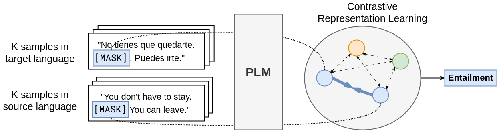

# Bridging Language Gaps: Enhancing Few-Shot Language Adaptation 🌁 



## Contrastive Language Alignment with Prompting (CoLAP) 🤝

### Quickstart

To begin working with CoLAP, clone the repository and set up your environment:

```bash
git clone https://github.com/*/CoLAP
```

Next, import the required packages and run this relation extraction example:

```python
import models
from data import to_colap_input
from transformers import AutoModelForMaskedLM, AutoTokenizer
import torch

tokenizer = AutoTokenizer.from_pretrained("xlm-roberta-base")
encoder = AutoModelForMaskedLM.from_pretrained("xlm-roberta-base", output_hidden_states=True)
model = models.CoLAP(encoder, args={"xrcl":True, "xccl":False})

# relation extraction example
sent_en = ["The coffee overflows from the cup. coffee <mask> cup",
           "Jake is the father of Finn. Jake <mask> Finn"]
sent_es = ["El café se desborda de la taza. café <mask> taza",
           "Jake es el padre de Finn. Jake <mask> Finn"]
label = ["located", "parent"]

label_scope = torch.unique(
    tokenizer(label, add_special_tokens=False, return_tensors="pt")["input_ids"]
    )

inputs = to_colap_input(
    data_source=sent_en,
    data_target=sent_es,
    label=label,
    label_source=label,
    tokenizer=tokenizer
    ) 

# train CoLAP
optimizer = torch.optim.AdamW(model.parameters(), lr=2e-5)

for i in range(10):
    loss = model.compute_loss(model, inputs.copy())
    loss.backward()
    optimizer.step()
    optimizer.zero_grad()
```

```python
# test performance
test_es = ["El perro salta sobre el sofá. perro <mask> sofá",
           "El hijo de Antonio se llama Juan. Antonio <mask> Juan"]
label = ["located", "parent"]

inputs_test = to_colap_input(data_target=test_es, label=label, tokenizer=tokenizer)

with torch.no_grad():
    outputs = model(**inputs_test)
    print([tokenizer.decode(label_scope[i]) for i in outputs.logits.argmax(-1).reshape(-1)])
# ['located', 'parent']
```

### Benchmark

To reproduce our benchmark results, download the datasets listed below and save them in the `datasets` directory. By default, the XNLI dataset is downloaded from the Hugging Face datasets library.

| Datasets | Links |
|---------|------|
| XNLI | [Paper](https://arxiv.org/abs/1809.05053),  [Data](https://github.com/facebookresearch/XNLI) |
| AmericasNLI | [Paper](https://arxiv.org/abs/2104.08726),  [Data](https://github.com/abteen/americasnli)     |
| MultiTACRED | [Paper](https://arxiv.org/abs/2305.04582),  [Data](https://github.com/DFKI-NLP/MultiTACRED)     |

We provide `train.py` with an overview of important input arguments:

- `task`: The dataset to use (e.g., "xnli", "amnli", or "tacred").
- `source_lang` and `target_lang`: Specify the source and target languages, respectively.
- `plm`: Pretrained language model to use, such as "xlm-roberta-base" or "microsoft/infoxlm-base".
- `K`: Determines the number of few-shot examples.
- `xrcl` | `no-xrcl`: Use the XRCL loss term in CoLAP (default).
- `xccl` | `no-xccl`: Use the XCCL loss term in CoLAP.
- `eval_zs`: Enable zero-shot performance evaluation.
- `eval_fs`: Enable few-shot training and evaluation.

For example, to fine-tune the XLM-R model on English XNLI data, use the following command:

```bash
python train.py \
    --task "xnli" \
    --target_lang "en" \
    --plm "xlm-roberta-base" \
    --epochs 5
```

Then, adapt the model to a target language (e.g., Vietnamese) with few-shot learning:

```bash
python train.py \
    --task "xnli" \
    --source_lang "en" \
    --target_lang "vi" \
    --plm "xlm-roberta-base" \
    --K 50 \
    --epochs 10 \
    --load_ckpt "checkpoints/xnli-xlm-roberta-base-en-colap" \
    --eval_zs \
    --eval_fs
```

## Reference
```bibtex
```